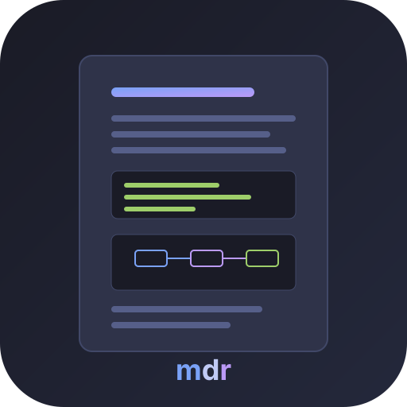
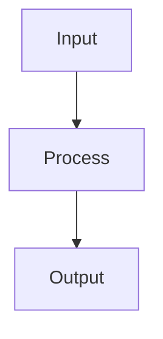

<p align="center">
  
</p>

<h1 align="center">mdr — Markdown Reader</h1>

<p align="center">
  A lightweight, fast Markdown viewer with Mermaid diagram support and live reload. Built in Rust.
</p>

## Why mdr?

**Built for the LLM era.** AI tools generate Markdown constantly — code documentation, technical specs, analysis reports — packed with diagrams, tables, and structured content. You need a fast way to read them.

Most developers end up previewing Markdown in VS Code, pasting into a browser, or squinting at raw text in the terminal. mdr renders Mermaid diagrams itself, and opens the file you give it without a project, a server or an extension.

- **One command** — `mdr file.md` and you're reading, not editing
- **Native Rust binary** — no Electron, no Node.js, no npm
- **Mermaid diagrams** — flowcharts, sequence diagrams, pie charts rendered as SVG natively (no headless browser)
- **Three backends** — a native window (`gui`), the system webview (`web`), or a terminal UI (`tui`) over SSH
- **Live reload** — edit your file or let your AI tool regenerate it, see changes instantly
- **In-document search** — Ctrl+F / `/` to find text across all backends
- **Fully keyboard-driven** — every backend quits, scrolls, searches and navigates from the keyboard

## Backends

mdr offers multiple rendering backends, selectable at runtime:

| Backend | Stack | Strengths |
|---------|-------|-----------|
| **`gui`** | Pure Rust GPU rendering (egui) | Native window, no JavaScript engine, cross-platform |
| **`web`** | OS native WebView (WebKit/WebView2) | GitHub-quality HTML/CSS rendering, full CSS support |
| **tui** | Terminal UI (ratatui + crossterm) | Works over SSH, no GUI needed, keyboard-driven |

`--backend` and the `backend` key of the config file pick one. The default is
`auto`, which chooses among the backends this binary was built with: `tui` over
SSH or with no display, and otherwise the first of `gui` and `web` that is
compiled in.

## Install

### From crates.io

```bash
cargo install mdr
# or, to download the release binary instead of compiling
cargo binstall mdr
```

> **Note**: `cargo install` compiles the three backends; on Linux that needs the
> [system dependencies](#linux-dependencies) below. `cargo binstall` downloads
> the release binary instead.

### From source

```bash
git clone https://github.com/CleverCloud/mdr.git
cd mdr
cargo install --path .
```

### Build with specific backends only

```bash
# gui only (smaller binary, no WebView dependency)
cargo install --path . --no-default-features --features egui-backend

# web only
cargo install --path . --no-default-features --features webview-backend
```

### Homebrew (macOS/Linux)

```bash
brew install CleverCloud/misc/mdr
```

### Snap (Linux)

```bash
sudo snap install --edge mdr-markdown-renderer
```

> **Note**: The snap command is `mdr-markdown-renderer`, not `mdr`. You can create an alias: `sudo snap alias mdr-markdown-renderer mdr`

### Scoop (Windows)

```powershell
scoop bucket add clevercloud https://github.com/CleverCloud/scoop-bucket
scoop install mdr
```

### Chocolatey (Windows)

```powershell
choco install mdr
```

### WinGet (Windows)

```powershell
winget install CleverCloud.mdr
```

### Nix

```bash
nix run github:CleverCloud/mdr
```

### Pre-built binaries

Download from the [Releases](https://github.com/CleverCloud/mdr/releases) page for macOS, Linux, and Windows.

## Usage

```bash
# Open with the backend mdr picks for this session
mdr README.md

# Open with the web backend
mdr --backend web README.md

# Open in terminal (TUI)
mdr --backend tui README.md

# Never touch the network (remote images are left unresolved)
mdr --offline README.md

# Render in the light colour scheme
mdr -t light README.md

# Show help
mdr --help
```

In `web`, clicking an `http(s)` link opens it in your system browser, and a
link to another local `.md` file opens that file in mdr. `gui` and `tui` have
no such routing.

### `gui` keybindings

| Key | Action |
|-----|--------|
| `q`, `Esc`, `Ctrl/Cmd+Q`, `Ctrl/Cmd+W` | Quit |
| `Ctrl/Cmd+F` | Search in the document |
| `Esc` | Close the search (quits when no search is open) |
| `F10` | Show or hide the table of contents |
| `t` | Switch between the light and dark theme |
| `j` / `↓`, `k` / `↑` | Scroll down / up |
| `Space` / `PgDn`, `PgUp` | Page down / up |
| `g` / `Home`, `G` / `End` | Go to top / bottom |

On macOS the shortcuts use ⌘, not ⌃.

### `web` keybindings

Press `?` in the `web` backend for this list.

| Key | Action |
|-----|--------|
| `Ctrl/Cmd+Q` | Close the window |
| `Ctrl/Cmd+F` | Search in the document |
| `n` / `N` | Next / previous search match |
| `Esc` | Close search, help or the expanded image |
| `j` / `↓`, `k` / `↑` | Scroll down / up |
| `Space` / `PgDn`, `PgUp` | Page down / up |
| `g` / `Home`, `G` / `End` | Go to top / bottom |
| `Ctrl/Cmd` + `+` / `-` / `0` | Zoom in / out / reset |
| `Ctrl/Cmd+B` | Show or hide the table of contents |
| `t` | Switch between the light and dark theme |
| `Ctrl/Cmd+P` | Print or export to PDF |
| `?` | Show or hide the shortcut list |

`t` flips the colour scheme of the current window, whether it came from
`prefers-color-scheme` or from `--theme`. It is a bare key on purpose: `Ctrl/Cmd+D`
is a split-pane shortcut in most terminals. Mermaid diagrams are the exception:
one rendered to SVG carries its own colours from the start, and one drawn in the
page is not recoloured once it is on screen.

### TUI keybindings

| Key | Action |
|-----|--------|
| `q` / `Esc` / `Ctrl+C` | Quit |
| `j` / `↓` | Scroll down |
| `k` / `↑` | Scroll up |
| `Space` / `PgDn` | Page down |
| `PgUp` | Page up |
| `g` / `Home` | Go to top |
| `G` / `End` | Go to bottom |
| `Tab` | Switch focus between TOC and content |
| `Enter` | Navigate to selected TOC heading |
| `/` or `Ctrl+F` | Open search |
| `n` | Next search match |
| `N` | Previous search match |
| `t` | Switch between the light and dark theme |

The terminal owns its own background, so `t` here switches the colours code
blocks are highlighted in. Each block paints the theme's own background, so both
themes stay legible whatever the terminal is set to.

## Features

- **GFM** — tables, task lists, strikethrough, footnotes, autolinks. `gui` draws
  tables itself
- **One parser for the structure** — comrak produces the HTML `web` renders,
  the lines `tui` draws, and the headings every table of contents is built
  from. `gui` draws through `egui_commonmark`, which reads the Markdown again
  with its own parser, so its typography — and, for tables and raw HTML, its
  rendering — is its own
- **Raw HTML in a document** — `web` hands it to a real engine. `gui` has none,
  so a short, explicit set of tags (headings, paragraphs, images) is rewritten
  as the Markdown that means the same thing, and anything else keeps its text
  and loses its tags. Only blocks at the top level of the document are
  converted; one nested in a quote or a list is left as written. Attributes
  with no Markdown equivalent, such as `align="center"`, are dropped, `<br>`
  becomes a space, and a declared `width` is honoured for vector images. A
  heading written in HTML becomes a real heading, so it appears in the `gui`
  table of contents where `web` does not list it. `tui` shows HTML as the text
  it is
- **Syntax highlighting** — code blocks with language detection (via syntect), in
  the terminal too. The palette follows the terminal background when it says what
  it is (`COLORFGBG`), and falls back to a dark one; `--theme dark|light` or
  `theme "light"` in the config file settles it when the terminal stays silent —
  Terminal.app and Alacritty do. The same setting picks the palette in `gui` and
  `web`.
- **Mermaid diagrams** — flowcharts, sequence diagrams, pie charts, and more (via mermaid-rs-renderer)
- **Table of Contents** — auto-generated sidebar from headings with click-to-navigate
- **Live reload** — file watching with 300ms debounce, updates on save
- **Dark/Light theme** — follows the OS by default; `--theme dark|light` (or
  `theme` in the config file) settles it. In `gui` and `web` it picks the whole
  palette; in `tui` the terminal owns its own colours, so it selects the syntax
  highlighting of code blocks and nothing more. `t` flips the scheme live in
  every backend
- **YAML front matter** — recognised as metadata, so it is neither rendered nor listed in the TOC
- **Unique heading anchors** — repeated headings get `setup`, `setup-1`, … as GitHub does

## Images

In `gui` and `web`, images are inlined into the document before rendering, so
nothing is fetched while you read. `tui` loads an image when it draws it, and
has its own path for that: no cache, and none of the size ceiling described
below.

- **Local images** resolve relative to the Markdown file, and may live anywhere
  inside the enclosing project — the nearest ancestor directory holding a
  `.git`, `.hg`, `.svn` or `.jj`. That makes the usual `docs/page.md` →
  `` layout work. The search for that marker stops at
  your home directory, so a document outside any project is restricted to its
  own directory. Anything outside the root that comes out of this is refused.
- **A document read from stdin** has no directory of its own — `cat README.md |
  mdr` writes it to a temp file — so its relative **image** paths resolve from
  the directory **mdr** was run in. `cd docs && cat page.md | mdr` therefore
  resolves them against `docs`, whatever directory `page.md` itself lives in.
  Links to other local files are not redirected this way: in `web` they are
  still resolved next to the temp file, so a piped document cannot follow them.
- **Remote images** (`http`/`https`, typically README badges) are downloaded
  once, cached for the lifetime of the process, and embedded as `data:` URIs.
  Responses larger than 16 MB are ignored.
- `mdr --offline file.md` disables every network access; remote images are then
  left unresolved. The same can be set permanently with `offline #true` in the
  config file.

## Configuration

mdr writes a commented config file with its defaults the first time it runs, so
there is nothing to scaffold and no flag to know about. Where it lands follows
the platform:

| Order | Path |
|---|---|
| 1 | `~/.config/mdr/config.kdl`, if it already exists |
| 2 | `$XDG_CONFIG_HOME/mdr/config.kdl`, when that variable holds an absolute path |
| 3 | `%APPDATA%\mdr\config.kdl`, on Windows |
| 4 | `~/.config/mdr/config.kdl` |

The order is the same on every platform; only step 3 is Windows-only. `HOME`
gives the home directory, except on Windows where `%USERPROFILE%` comes first,
since Git Bash sets `HOME` to a POSIX path a native binary cannot resolve.

Step 1 is a deliberate departure from the XDG spec, which says the variable
wins: every mdr before 0.6 read `~/.config/mdr/config.kdl` and nothing else, so
letting `XDG_CONFIG_HOME` take precedence would silently ignore the config of
everyone who has both. A relative `XDG_CONFIG_HOME` is ignored with a warning,
as the spec requires. `-c, --config PATH` points somewhere else; a path given
there must exist, since a typo is a mistake rather than a request to create a
file.

If no environment variable names a home directory, mdr says so and reads
`./.config/mdr/config.kdl` if it happens to exist — but does not create one
there, rather than leaving a `.config/` behind in whatever directory it was
started from. A file that is already there is treated like any other config,
old backend name included.

The file is [KDL v2](https://kdl.dev). Four keys are recognised, each mirroring
the command line option of the same name:

`mdr -s web` writes the backend into the file for you, leaving comments and
every other setting alone; it refuses a backend the binary was not built with.

The backends were called `egui` and `webview` before 0.6. A config file holding
one of the old names is corrected in place the first time it is read — comments
and every other setting kept — and the run says so once. A file mdr cannot
write, because it is read-only or a symlink, is left alone with a warning and
still read with the old name understood. On the command line there is no such
mapping: `--backend egui` is not a backend any more, and the error lists the
ones that are.

```kdl
backend auto      // auto, gui, tui or web
verbose #true     // same as -v
offline #true     // same as --offline
theme "auto"      // auto, dark or light
```

## Mermaid Support

Mermaid code fences are rendered as SVG diagrams:

````markdown

````

Supported diagram types: flowchart, sequence, pie, class, state, ER, gantt.

> **Note**: Diamond/decision nodes (`{text}`) are not yet supported by the underlying renderer. Use square brackets as a workaround.

## Architecture

```
src/
├── main.rs              # CLI (clap), backend dispatch
├── core/
│   ├── markdown.rs      # GFM parsing (comrak) + CSS
│   ├── mermaid.rs       # Mermaid → SVG rendering
│   ├── toc.rs           # Heading extraction for TOC
│   ├── slug.rs          # Heading anchors, shared by the renderer and the TOC
│   ├── sanitize.rs      # Strips scripts and event handlers from raw HTML
│   ├── paths.rs         # Which directory tree images may be read from
│   ├── net.rs           # Remote image fetching (respects --offline)
│   └── watcher.rs       # File watching (notify, 300ms debounce)
└── backend/
    ├── egui.rs          # `gui` backend (egui/eframe)
    ├── tui.rs           # ratatui/crossterm TUI backend
    └── webview.rs       # `web` backend (wry/tao)
```

## Building

Requires Rust 1.95 or later (the floor comes from `kdl`; the MSRV is checked in CI).

```bash
# All backends (default)
cargo build --release

# Run tests
cargo test

# Run clippy exactly as CI does
cargo clippy --all-features --all-targets -- -D warnings
```

### Linux dependencies

```bash
sudo apt-get install libgtk-3-dev libwebkit2gtk-4.1-dev libxdo-dev libgl1-mesa-dev
```

## Releases

Pre-built binaries are available on the [Releases](https://github.com/CleverCloud/mdr/releases) page for:
- macOS (Apple Silicon + Intel)
- Linux (x86_64 + aarch64)
- Windows (x86_64)

Each release publishes to crates.io, and updates the Homebrew tap, the Scoop
bucket, the Chocolatey package and the Snap Store (`edge` channel) for whichever
of those channels is enabled — each one is gated on its own variable and needs
its own secret, so a release still succeeds when a channel is not configured.
See [PACKAGING.md](PACKAGING.md) for the setup.

Release notes are the matching section of [CHANGELOG.md](CHANGELOG.md), so add
it before pushing the tag.

To create a release, push a version tag:

```bash
git tag v0.4.0
git push origin v0.4.0
```

## License

MIT

## Contributing

Issues and PRs welcome at [github.com/CleverCloud/mdr](https://github.com/CleverCloud/mdr).
