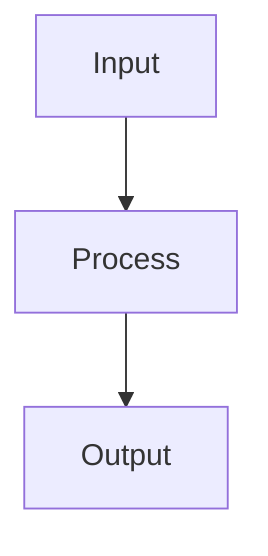

<p align="center">
  
</p>

<h1 align="center">mdr — Markdown Reader</h1>

<p align="center">
  A lightweight, fast Markdown viewer with Mermaid diagram support and live reload. Built in Rust.
</p>

## Why mdr?

**Built for the LLM era.** AI tools generate Markdown constantly — code documentation, technical specs, analysis reports — packed with diagrams, tables, and structured content. You need a fast way to read them.

Most developers end up previewing Markdown in VS Code, pasting into a browser, or squinting at raw text in the terminal. None of these handle Mermaid diagrams. None are instant. mdr is.

- **One command** — `mdr file.md` and you're reading, not editing
- **Native Rust binary** — no Electron, no Node.js, no npm, starts in milliseconds
- **Mermaid diagrams** — flowcharts, sequence diagrams, pie charts rendered as SVG natively (no headless browser)
- **Three backends** — a native window (`gui`), the system webview (`web`), or a terminal UI (`tui`) over SSH
- **Live reload** — edit your file or let your AI tool regenerate it, see changes instantly
- **In-document search** — Ctrl+F / `/` to find text across all backends
- **Fully keyboard-driven** — every backend quits, scrolls, searches and navigates from the keyboard

## Backends

mdr offers multiple rendering backends, selectable at runtime:

| Backend | Stack | Strengths |
|---------|-------|-----------|
| **`gui`** (default) | Pure Rust GPU rendering (egui) | Single static binary, fast startup, cross-platform |
| **`web`** | OS native WebView (WebKit/WebView2) | GitHub-quality HTML/CSS rendering, full CSS support |
| **tui** | Terminal UI (ratatui + crossterm) | Works over SSH, no GUI needed, keyboard-driven |

## Install

### From crates.io

```bash
cargo install mdr
# or, to download the release binary instead of compiling
cargo binstall mdr
```

> **Note**: `cargo install` compiles the three backends; on Linux that needs the
> [system dependencies](#linux-dependencies) below. `cargo binstall` downloads
> the release binary instead.

### From source

```bash
git clone https://github.com/CleverCloud/mdr.git
cd mdr
cargo install --path .
```

### Build with specific backends only

```bash
# gui only (smaller binary, no WebView dependency)
cargo install --path . --no-default-features --features egui-backend

# web only
cargo install --path . --no-default-features --features webview-backend
```

### Homebrew (macOS/Linux)

```bash
brew install CleverCloud/misc/mdr
```

### Snap (Linux)

```bash
sudo snap install --edge mdr-markdown-renderer
```

> **Note**: The snap command is `mdr-markdown-renderer`, not `mdr`. You can create an alias: `sudo snap alias mdr-markdown-renderer mdr`

### Scoop (Windows)

```powershell
scoop bucket add clevercloud https://github.com/CleverCloud/scoop-bucket
scoop install mdr
```

### Chocolatey (Windows)

```powershell
choco install mdr
```

### WinGet (Windows)

```powershell
winget install CleverCloud.mdr
```

### Nix

```bash
nix run github:CleverCloud/mdr
```

### Pre-built binaries

Download from the [Releases](https://github.com/CleverCloud/mdr/releases) page for macOS, Linux, and Windows.

## Usage

```bash
# Open with the default backend (gui)
mdr README.md

# Open with the web backend
mdr --backend web README.md

# Open in terminal (TUI)
mdr --backend tui README.md

# Never touch the network (remote images are left unresolved)
mdr --offline README.md

# Force the palette used to highlight code in the terminal
mdr -t light README.md

# Show help
mdr --help
```

Clicking an `http(s)` link opens it in your system browser; a link to another
local `.md` file opens that file in mdr.

### `gui` keybindings

| Key | Action |
|-----|--------|
| `q`, `Esc`, `Ctrl/Cmd+Q`, `Ctrl/Cmd+W` | Quit |
| `Ctrl/Cmd+F` | Search in the document |
| `Esc` | Close the search (quits when no search is open) |
| `F10` | Show or hide the table of contents |
| `j` / `↓`, `k` / `↑` | Scroll down / up |
| `Space` / `PgDn`, `PgUp` | Page down / up |
| `g` / `Home`, `G` / `End` | Go to top / bottom |

On macOS the shortcuts use ⌘, not ⌃.

### `web` keybindings

Press `?` in the `web` backend for this list.

| Key | Action |
|-----|--------|
| `Ctrl/Cmd+Q` | Close the window |
| `Ctrl/Cmd+F` | Search in the document |
| `n` / `N` | Next / previous search match |
| `Esc` | Close search, help or the expanded image |
| `j` / `↓`, `k` / `↑` | Scroll down / up |
| `Space` / `PgDn`, `PgUp` | Page down / up |
| `g` / `Home`, `G` / `End` | Go to top / bottom |
| `Ctrl/Cmd` + `+` / `-` / `0` | Zoom in / out / reset |
| `Ctrl/Cmd+B` | Show or hide the table of contents |
| `Ctrl/Cmd+D` | Switch between the light and dark theme |
| `Ctrl/Cmd+P` | Print or export to PDF |
| `?` | Show or hide the shortcut list |

`Ctrl/Cmd+D` overrides the system colour scheme for the current window; without it
the theme follows `prefers-color-scheme`.

### TUI keybindings

| Key | Action |
|-----|--------|
| `q` / `Esc` / `Ctrl+C` | Quit |
| `j` / `↓` | Scroll down |
| `k` / `↑` | Scroll up |
| `Space` / `PgDn` | Page down |
| `PgUp` | Page up |
| `g` / `Home` | Go to top |
| `G` / `End` | Go to bottom |
| `Tab` | Switch focus between TOC and content |
| `Enter` | Navigate to selected TOC heading |
| `/` or `Ctrl+F` | Open search |
| `n` | Next search match |
| `N` | Previous search match |

## Features

- **Full GFM support** — tables, task lists, strikethrough, footnotes, autolinks
- **One parser for every backend** — the terminal output is derived from the
  same comrak parse as the HTML, so the three backends cannot disagree on the
  structure of a document
- **Syntax highlighting** — code blocks with language detection (via syntect), in
  the terminal too. The palette follows the terminal background when it says what
  it is (`COLORFGBG`), and falls back to a dark one; `--theme dark|light` or
  `theme "light"` in the config file settles it when the terminal stays silent —
  Terminal.app and Alacritty do.
- **Mermaid diagrams** — flowcharts, sequence diagrams, pie charts, and more (via mermaid-rs-renderer)
- **Table of Contents** — auto-generated sidebar from headings with click-to-navigate
- **Live reload** — file watching with 300ms debounce, updates on save
- **Dark/Light theme** — follows OS theme, overridable with `Ctrl/Cmd+D` (`web` backend)
- **YAML front matter** — recognised as metadata, so it is neither rendered nor listed in the TOC
- **Unique heading anchors** — repeated headings get `setup`, `setup-1`, … as GitHub does

## Images

Images are inlined into the document before rendering, so nothing is fetched
while you read.

- **Local images** resolve relative to the Markdown file, and may live anywhere
  inside the enclosing project — the nearest ancestor directory holding a
  `.git`, `.hg`, `.svn` or `.jj`. That makes the usual `docs/page.md` →
  `` layout work. Outside that root, and above your
  home directory, images are refused.
- **Remote images** (`http`/`https`, typically README badges) are downloaded
  once, cached for the lifetime of the process, and embedded as `data:` URIs.
  Responses larger than 16 MB are ignored.
- `mdr --offline file.md` disables every network access; remote images are then
  left unresolved. The same can be set permanently with `offline #true` in the
  config file.

## Configuration

mdr writes a commented config file with its defaults the first time it runs, so
there is nothing to scaffold and no flag to know about. Where it lands follows
the platform:

| Order | Path |
|---|---|
| 1 | `~/.config/mdr/config.kdl`, if it already exists |
| 2 | `$XDG_CONFIG_HOME/mdr/config.kdl`, when that variable holds an absolute path |
| 3 | `%APPDATA%\mdr\config.kdl`, on Windows |
| 4 | `~/.config/mdr/config.kdl` |

The order is the same on every platform; only step 3 is Windows-only. `HOME`
gives the home directory, except on Windows where `%USERPROFILE%` comes first,
since Git Bash sets `HOME` to a POSIX path a native binary cannot resolve.

Step 1 is a deliberate departure from the XDG spec, which says the variable
wins: every mdr before 0.6 read `~/.config/mdr/config.kdl` and nothing else, so
letting `XDG_CONFIG_HOME` take precedence would silently ignore the config of
everyone who has both. A relative `XDG_CONFIG_HOME` is ignored with a warning,
as the spec requires. `-c, --config PATH` points somewhere else; a path given
there must exist, since a typo is a mistake rather than a request to create a
file.

If no environment variable names a home directory, mdr says so and reads
`./.config/mdr/config.kdl` if it happens to exist — but does not create one
there, rather than leaving a `.config/` behind in whatever directory it was
started from. A file that is already there is treated like any other config,
including having an old backend name corrected in it.

The file is [KDL v2](https://kdl.dev). Four keys are recognised, each mirroring
the command line option of the same name:

`mdr -s web` writes the backend into the file for you, leaving comments and
every other setting alone; it refuses a backend the binary was not built with.

```kdl
backend auto      // auto, gui, tui or web
verbose #true     // same as -v
offline #true     // same as --offline
theme "auto"      // auto, dark or light
```

## Mermaid Support

Mermaid code fences are rendered as SVG diagrams:

````markdown

````

Supported diagram types: flowchart, sequence, pie, class, state, ER, gantt.

> **Note**: Diamond/decision nodes (`{text}`) are not yet supported by the underlying renderer. Use square brackets as a workaround.

## Architecture

```
src/
├── main.rs              # CLI (clap), backend dispatch
├── core/
│   ├── markdown.rs      # GFM parsing (comrak) + CSS
│   ├── mermaid.rs       # Mermaid → SVG rendering
│   ├── toc.rs           # Heading extraction for TOC
│   ├── slug.rs          # Heading anchors, shared by the renderer and the TOC
│   ├── sanitize.rs      # Strips scripts and event handlers from raw HTML
│   ├── paths.rs         # Which directory tree images may be read from
│   ├── net.rs           # Remote image fetching (respects --offline)
│   └── watcher.rs       # File watching (notify, 300ms debounce)
└── backend/
    ├── egui.rs          # `gui` backend (egui/eframe)
    ├── tui.rs           # ratatui/crossterm TUI backend
    └── webview.rs       # `web` backend (wry/tao)
```

## Building

Requires Rust 1.95 or later (the floor comes from `kdl`; the MSRV is checked in CI).

```bash
# All backends (default)
cargo build --release

# Run tests
cargo test

# Run clippy exactly as CI does
cargo clippy --all-features --all-targets -- -D warnings
```

### Linux dependencies

```bash
sudo apt-get install libgtk-3-dev libwebkit2gtk-4.1-dev libxdo-dev libgl1-mesa-dev
```

## Releases

Pre-built binaries are available on the [Releases](https://github.com/CleverCloud/mdr/releases) page for:
- macOS (Apple Silicon + Intel)
- Linux (x86_64 + aarch64)
- Windows (x86_64)

Each release also updates the Homebrew tap, the Scoop bucket, the Chocolatey
package, the Snap Store (`edge` channel) and crates.io — see
[PACKAGING.md](PACKAGING.md) for the publishing setup.

Release notes are the matching section of [CHANGELOG.md](CHANGELOG.md), so add
it before pushing the tag.

To create a release, push a version tag:

```bash
git tag v0.4.0
git push origin v0.4.0
```

## License

MIT

## Contributing

Issues and PRs welcome at [github.com/CleverCloud/mdr](https://github.com/CleverCloud/mdr).
