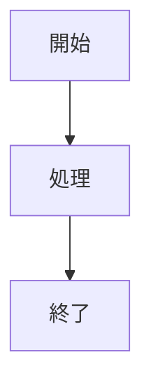

# egui日本語フォント対応 Implementation Plan

> **For Claude:** REQUIRED SUB-SKILL: Use executing-plans to implement this plan task-by-task.

**Goal:** egui版Markdownビューアーに Noto Sans JP Regular を `include_bytes!` で埋め込み、日本語テキストの豆腐問題を修正する（egui UIテキスト＋Mermaid/SVG描画の両方）

**Architecture:** `assets/fonts/` に Noto Sans JP Regular の ttf ファイルとライセンスを配置。`src/backend/egui.rs` で `include_bytes!` でフォントを読み込み、`eframe::run_native` の `CreationContext` クロージャ内で `egui::FontDefinitions` に日本語フォントをフォールバックとして登録する。Mermaid/SVG描画用に `usvg::fontdb` にもバンドルフォントを登録する。

**Tech Stack:** Rust, eframe 0.33, egui, egui_commonmark 0.22, usvg 0.45

**Authoritative Inputs:**
- Discovery Log: `docs/plans/2026-03-24-egui-japanese-font-discovery.md`
- Approved Design: `docs/plans/2026-03-24-egui-japanese-font-design.md`

---

## Task 1: フォントファイルの配置

**Files:**
- Create: `assets/fonts/NotoSansJP-Regular.ttf`
- Create: `assets/fonts/OFL.txt`

**Step 1: Noto Sans JP をダウンロード**

google/fontsリポジトリでは Variable Font (`NotoSansJP[wght].ttf`) に移行済み。Google Fonts APIからスタティック版を取得するか、Variable Fontを使用する。

Option A: Google Fonts release archive からスタティック版を取得:
```bash
mkdir -p assets/fonts
curl -L -o /tmp/NotoSansJP.zip \
  "https://fonts.google.com/download?family=Noto+Sans+JP"
unzip -j /tmp/NotoSansJP.zip "static/NotoSansJP-Regular.ttf" -d assets/fonts/
```

Option B: Variable Fontを直接使用（egui は Variable Font もサポート）:
```bash
mkdir -p assets/fonts
curl -L -o "assets/fonts/NotoSansJP-Regular.ttf" \
  "https://github.com/google/fonts/raw/main/ofl/notosansjp/NotoSansJP%5Bwght%5D.ttf"
```

Note: どちらでも `include_bytes!` で埋め込み可能。Option Aが失敗する場合はOption Bを使用。ファイル名は `NotoSansJP-Regular.ttf` に統一する。

**Step 2: OFLライセンスファイルをダウンロード**
```bash
curl -L -o assets/fonts/OFL.txt \
  "https://github.com/google/fonts/raw/main/ofl/notosansjp/OFL.txt"
```

**Step 3: ファイルの存在を確認**
```bash
ls -la assets/fonts/
```
Expected: `NotoSansJP-Regular.ttf`（約5-8MB）と `OFL.txt` が存在

**Step 4: コミット**
```bash
git add assets/fonts/NotoSansJP-Regular.ttf assets/fonts/OFL.txt
git commit -m "Add Noto Sans JP Regular font and OFL license"
```

---

## Task 2: egui.rs にフォント登録コードを追加

**Files:**
- Modify: `src/backend/egui.rs:8` (定数追加)
- Modify: `src/backend/egui.rs:47` (CreationContextクロージャ内でフォント設定)

**Step 1: フォントデータの定数を追加**

`src/backend/egui.rs` の先頭（`use` 文の後、`pub fn run` の前）に以下を追加:

```rust
const NOTO_SANS_JP: &[u8] = include_bytes!("../../assets/fonts/NotoSansJP-Regular.ttf");
```

**Step 2: CreationContextクロージャ内でフォント登録**

`src/backend/egui.rs` 47行目の `Box::new(move |_cc|` を修正して、フォント設定を追加:

変更前:
```rust
        Box::new(move |_cc| {
            Ok(Box::new(MdrApp {
```

変更後:
```rust
        Box::new(move |cc| {
            // Register Noto Sans JP as a fallback font for Japanese text
            let mut fonts = egui::FontDefinitions::default();
            fonts.font_data.insert(
                "NotoSansJP".to_owned(),
                std::sync::Arc::new(egui::FontData::from_static(NOTO_SANS_JP)),
            );
            fonts
                .families
                .entry(egui::FontFamily::Proportional)
                .or_default()
                .push("NotoSansJP".to_owned());
            fonts
                .families
                .entry(egui::FontFamily::Monospace)
                .or_default()
                .push("NotoSansJP".to_owned());
            cc.egui_ctx.set_fonts(fonts);

            Ok(Box::new(MdrApp {
```

Note: `egui::FontData::from_static()` を `std::sync::Arc::new()` で包む必要がある（egui/epaint 0.33 の `font_data` は `BTreeMap<String, Arc<FontData>>` を期待する）。

**Step 3: ビルド確認**
```bash
cargo build --no-default-features --features egui-backend
```
Expected: コンパイル成功（warningのみ許容）

**Step 4: コミット**
```bash
git add src/backend/egui.rs
git commit -m "Add Japanese font support to egui backend

Embed Noto Sans JP Regular via include_bytes! and register it
as a fallback font for both Proportional and Monospace families."
```

---

## Task 3: Mermaid/SVG描画の日本語フォント対応

**Files:**
- Modify: `src/core/mermaid.rs:140-144` (fontdbにバンドルフォント追加)
- Modify: `src/backend/egui.rs:474-479` (SVGラスタライズのfontdbにバンドルフォント追加)

**Step 1: mermaid.rs のfontdbにバンドルフォントを追加**

`src/core/mermaid.rs` 132行目付近の `svg_to_png_base64` 関数内、`FONTDB` の初期化を修正:

変更前 (140-144行):
```rust
    static FONTDB: OnceLock<Arc<usvg::fontdb::Database>> = OnceLock::new();
    let fontdb = FONTDB.get_or_init(|| {
        let mut db = usvg::fontdb::Database::new();
        db.load_system_fonts();
        Arc::new(db)
    });
```

変更後:
```rust
    static FONTDB: OnceLock<Arc<usvg::fontdb::Database>> = OnceLock::new();
    let fontdb = FONTDB.get_or_init(|| {
        let mut db = usvg::fontdb::Database::new();
        db.load_system_fonts();
        db.load_font_data(include_bytes!("../../assets/fonts/NotoSansJP-Regular.ttf").to_vec());
        Arc::new(db)
    });
```

**Step 2: egui.rs のSVGラスタライズのfontdbにも同様に追加**

`src/backend/egui.rs` の `rasterize_svg_to_png_data_uri` 関数内、`FONTDB` の初期化を修正:

変更前 (474-479行):
```rust
    static FONTDB: OnceLock<Arc<usvg::fontdb::Database>> = OnceLock::new();
    let fontdb = FONTDB.get_or_init(|| {
        let mut db = usvg::fontdb::Database::new();
        db.load_system_fonts();
        Arc::new(db)
    });
```

変更後:
```rust
    static FONTDB: OnceLock<Arc<usvg::fontdb::Database>> = OnceLock::new();
    let fontdb = FONTDB.get_or_init(|| {
        let mut db = usvg::fontdb::Database::new();
        db.load_system_fonts();
        db.load_font_data(NOTO_SANS_JP.to_vec());
        Arc::new(db)
    });
```

Note: `egui.rs` では既に `NOTO_SANS_JP` 定数があるのでそれを再利用。`mermaid.rs` では `include_bytes!` を直接使用（`mermaid.rs` は `egui-backend` feature以外でもコンパイルされるため、条件付きコンパイルを考慮し `#[cfg(feature = "egui-backend")]` ブロック内なので問題なし）。

**Step 3: ビルド確認**
```bash
cargo build --no-default-features --features egui-backend
```
Expected: コンパイル成功

**Step 4: コミット**
```bash
git add src/core/mermaid.rs src/backend/egui.rs
git commit -m "Add Japanese font to Mermaid/SVG rendering fontdb

Load bundled Noto Sans JP into usvg::fontdb so Japanese text
in Mermaid diagrams and SVG images renders correctly."
```

---

## Task 4: 手動テスト

**Step 1: 日本語テスト用Markdownファイルを作成**
```bash
cat > /tmp/test-japanese.md << 'EOF'
# 日本語テスト

## ひらがな
あいうえお かきくけこ

## カタカナ
アイウエオ カキクケコ

## 漢字
東京都 大阪府 京都市

## 混合テキスト
Rustは高速で安全なシステムプログラミング言語です。

## コードブロック
```rust
// 日本語コメント
fn main() {
    println!("こんにちは世界！");
}
```

## テーブル
| 名前 | 説明 |
|------|------|
| mdr | Markdownリーダー |
| egui | GUIフレームワーク |

## Mermaid図（日本語）

EOF
```

**Step 2: egui版で表示確認**
```bash
cargo run --no-default-features --features egui-backend -- /tmp/test-japanese.md
```
Expected:
- 全テキストが日本語で正しく表示される（豆腐なし）
- TOCに日本語見出しが表示される
- 検索バーに日本語入力が可能
- コードブロック内の日本語コメントが表示される
- Mermaid図内の日本語ラベルが表示される

**Step 3: テスト用ファイルはコミットしない（一時ファイル）**

---

## 完了条件

- [ ] `assets/fonts/NotoSansJP-Regular.ttf` と `OFL.txt` がリポジトリに存在
- [ ] `src/backend/egui.rs` にフォント登録コードが追加されている
- [ ] `src/core/mermaid.rs` と `src/backend/egui.rs` のfontdbにバンドルフォントが登録されている
- [ ] `cargo build --no-default-features --features egui-backend` が成功する
- [ ] 日本語Markdownファイルでegui版を起動し、豆腐にならないことを確認
- [ ] Mermaid図内の日本語ラベルが表示されることを確認
